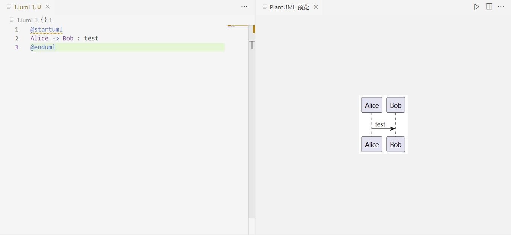
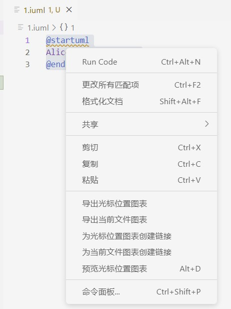
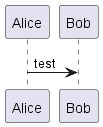

# plantUML-first
在vscode中, 实现plantUML的制作, 预览 和 导出

## 制作
- 安装vscode插件: `PlantUML`
- 编写iuml文件

``` python
@startuml
Alice -> Bob : test
@enduml

```

## 预览
Alt + D or Option + D



## 导出
右键选中iuml代码 ==> 导出光标位置图标



### 导出结果


## 更多命令
https://plantuml.com/zh/sequence-diagram
